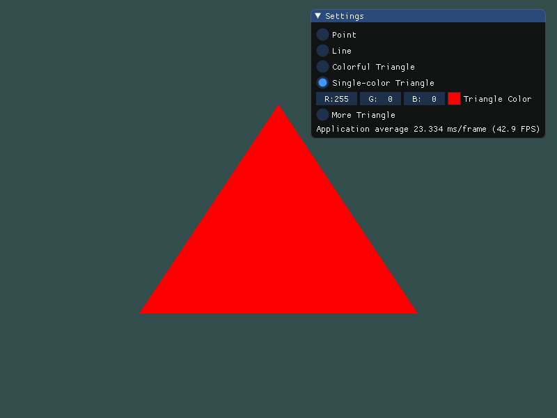
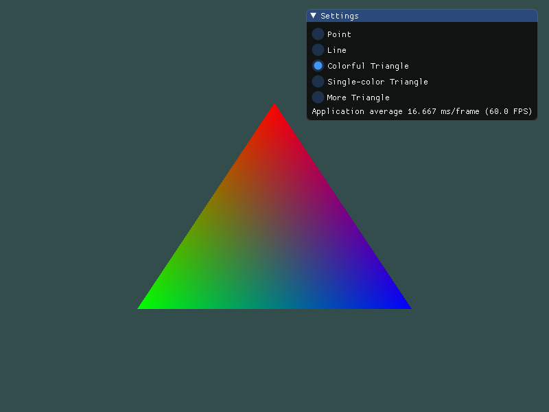
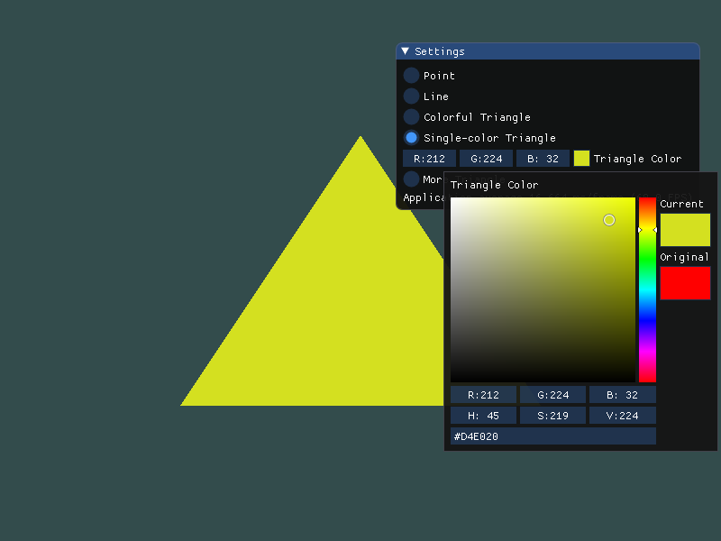
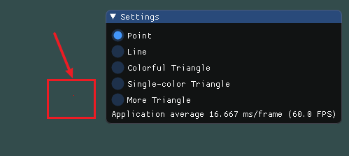
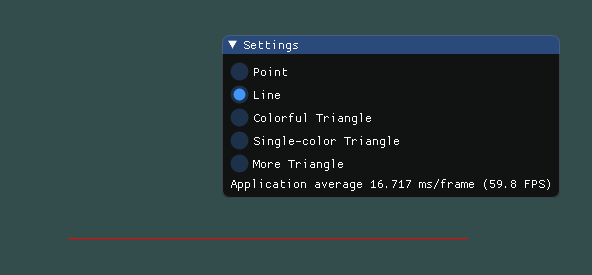
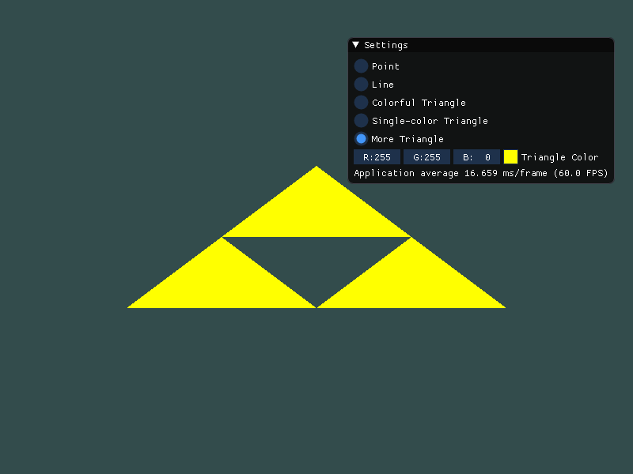

# Homework 2

姓名：陈秀嘉

学号：16340040

专业：软件工程(计算机应用)

## Basic

### 1. 使用OpenGL和GLFW画一个简单的三角形。

本次作业依赖于`OpenGL 4.6`、`GLFW 3.2.1`、`GLAD 4.6-core`、`IMGUI`。

首先利用GLFW初始化OpenGL以及创建Windows窗口，这里通过指定Swap Interval来实现垂直同步，防止帧率过高(禁止垂直同步时帧率可达1500FPS)。

```cpp
glfwInit();
glfwWindowHint(GLFW_CONTEXT_VERSION_MAJOR, 4);
glfwWindowHint(GLFW_CONTEXT_VERSION_MINOR, 6);
glfwWindowHint(GLFW_OPENGL_PROFILE, GLFW_OPENGL_CORE_PROFILE);

GLFWwindow* window = glfwCreateWindow(800, 600, "CG Homework", NULL, NULL);
if (window == NULL) {
    std::cout << "Failed to create GLFW window" << std::endl;
    glfwTerminate();
    return -1;
}
glfwMakeContextCurrent(window);
glfwSwapInterval(1); // V-Sync
```

然后使用GLAD来绑定OpenGL的函数地址。

```cpp
if (!gladLoadGL()) {
    std::cout << "Failed to initialize GLAD" << std::endl;
    glfwTerminate();
    return -1;
}
```

参考IMGUI的OpenGL+GLFW范例，编写如下的循环。

```cpp
IMGUI_CHECKVERSION();
ImGui::CreateContext();
ImGui::StyleColorsDark();
ImGui_ImplGlfw_InitForOpenGL(window, true);
ImGui_ImplOpenGL3_Init(NULL);

Application app;

while (!glfwWindowShouldClose(window)) {
    glfwPollEvents();

    ImGui_ImplOpenGL3_NewFrame();
    ImGui_ImplGlfw_NewFrame();
    ImGui::NewFrame();

    glClearColor(0.2f, 0.3f, 0.3f, 1.0f);
    glClear(GL_COLOR_BUFFER_BIT);

    app.update();

    ImGui::Render();
    int display_w, display_h;
    glfwMakeContextCurrent(window);
    glfwGetFramebufferSize(window, &display_w, &display_h);
    glViewport(0, 0, display_w, display_h);

    ImGui_ImplOpenGL3_RenderDrawData(ImGui::GetDrawData());
    glfwMakeContextCurrent(window);
    glfwSwapBuffers(window);
}

ImGui_ImplOpenGL3_Shutdown();
ImGui_ImplGlfw_Shutdown();
ImGui::DestroyContext();
```

我们实现一个`Application`的封装类，将需要渲染的IMGUI内容和OpenGL内容都写在`update`函数中。接下来实现一个顶点着色器和片段着色器，其中前者接受一个uniform全局变量，用于设定三角形的颜色。

```glsl
#version 460 core

layout (location = 0) in vec3 p;

uniform vec3 uniColor;

out vec3 outColor;

void main() {
	gl_Position = vec4(p.xyz, 1.0);
	outColor = uniColor;
}
```

```glsl
#version 460 core

in vec3 outColor;

out vec4 FragColor;

void main() {
	FragColor = vec4(outColor.rgb, 1.0);
}
```

然后生成VAO和VBO，并设置uniform全局变量`uniColor`的值。

```cpp
glGenVertexArrays(5, VAOs);
glGenBuffers(5, VBOs);

const float singleColorTriVertices[9] = {
     0.0f,  0.5f, 0.0f,
    -0.5f, -0.5f, 0.0f,
     0.5f, -0.5f, 0.0f,
};
float color[3] = { 1.0f, 0.0f, 0.0f };

// Single-color Triangle
glBindVertexArray(VAOs[3]);
glBindBuffer(GL_ARRAY_BUFFER, VBOs[3]);
glBufferData(GL_ARRAY_BUFFER, sizeof(singleColorTriVertices), singleColorTriVertices, GL_STATIC_DRAW);
glVertexAttribPointer(0, 3, GL_FLOAT, GL_FALSE, 3 * sizeof(float), (void*) 0);
glEnableVertexAttribArray(0);
glBindBuffer(GL_ARRAY_BUFFER, 0);
glBindVertexArray(0);

shaderWithUniColor.use();
shaderWithUniColor.setVec3("uniColor", color);
```

最后在渲染中绘制三角形。

```cpp
shaderWithUniColor.use();
glBindVertexArray(VAOs[3]);
glDrawArrays(GL_TRIANGLES, 0, 3);
```



### 2. 对三角形的三个顶点分别改为红绿蓝。

既然不同顶点使用不同颜色，那就针对每个顶点存储颜色数据，而不是使用uniform变量。所以我们需要修改顶点着色器，使其获取两个三维向量，一个表示位置，一个表示颜色。

```glsl
#version 460 core

layout (location = 0) in vec3 p;
layout (location = 1) in vec3 inColor;

out vec3 outColor;

void main() {
	gl_Position = vec4(p.xyz, 1.0);
	outColor = inColor;
}
```

在绑定缓冲区时，指定新的偏移和数据步长。

```cpp
const float colorfulTriVertices[18] = {
     0.0f,  0.5f, 0.0f, 1.0f, 0.0f, 0.0f,
    -0.5f, -0.5f, 0.0f, 0.0f, 1.0f, 0.0f,
     0.5f, -0.5f, 0.0f, 0.0f, 0.0f, 1.0f
};

// Colorful Triangle
glBindVertexArray(VAOs[2]);
glBindBuffer(GL_ARRAY_BUFFER, VBOs[2]);
glBufferData(GL_ARRAY_BUFFER, sizeof(colorfulTriVertices), colorfulTriVertices, GL_STATIC_DRAW);
glVertexAttribPointer(0, 3, GL_FLOAT, GL_FALSE, 6 * sizeof(float), (void*) 0);
glEnableVertexAttribArray(0);
glVertexAttribPointer(1, 3, GL_FLOAT, GL_FALSE, 6 * sizeof(float), (void*) (3 * sizeof(float)));
glEnableVertexAttribArray(1);
glBindBuffer(GL_ARRAY_BUFFER, 0);
glBindVertexArray(0);
```



之所以出现这种效果，是因为在渲染的时候使用了插值法。在两个顶点之间的线上的点的RGB值由该点到顶点的距离决定，比如在绿和红的三分之一点处，G通道的值是两者和的三分之一，R通道的值是两者的和的三分之一。因为三角形三个顶点都有颜色，实际上三角形上的点是受到了三个点的共同影响。

### 3. 给上述工作添加一个GUI，里面有个菜单栏，使得可以选择并改变三角形的颜色。

使用IMGUI实现一系列RadioButton按钮，并且在按钮指定为`Single-color Triangle`的时候显示颜色编辑器。并且在编辑器被使用的时候，可以动态修改uniform变量的值，从而达到修改颜色的效果。

```cpp
ImGui::Begin("Settings", NULL, ImGuiWindowFlags_AlwaysAutoResize);
ImGui::RadioButton("Point", &objectType, 0);
ImGui::RadioButton("Line", &objectType, 1);
ImGui::RadioButton("Colorful Triangle", &objectType, 2);
ImGui::RadioButton("Single-color Triangle", &objectType, 3);
if (objectType == 3) {
    if (ImGui::ColorEdit3("Triangle Color", color)) {
        shaderWithUniColor.setVec3("uniColor", color);
    }
}
ImGui::RadioButton("More Triangle", &objectType, 4);
if (objectType == 4) {
    if (ImGui::ColorEdit3("Triangle Color", color)) {
        shaderWithUniColor.setVec3("uniColor", color);
    }
}
ImGui::Text("Application average %.3f ms/frame (%.1f FPS)", 1000.0f / ImGui::GetIO().Framerate, ImGui::GetIO().Framerate);
ImGui::End();
```



## Bonus

### 1. 绘制其它图元，除了三角形，还有点、线等。

绘制点和线很简单，绑定缓冲区的方式与绘制三角形一样，只不过在绘制的过程中指定了不一样的宏。

```cpp
const float pointVertices[6] = { 0.0f, 0.0f, 0.0f, 1.0f, 0.0f, 0.0f };
const float lineVertices[12] = {
    -0.5f, 0.0f, 0.0f, 1.0f, 0.0f, 0.0f,
     0.5f, 0.0f, 0.0f, 1.0f, 0.0f, 0.0f
};

// Point
glBindVertexArray(VAOs[0]);
glBindBuffer(GL_ARRAY_BUFFER, VBOs[0]);
glBufferData(GL_ARRAY_BUFFER, sizeof(pointVertices), pointVertices, GL_STATIC_DRAW);
glVertexAttribPointer(0, 3, GL_FLOAT, GL_FALSE, 6 * sizeof(float), (void*) 0);
glEnableVertexAttribArray(0);
glVertexAttribPointer(1, 3, GL_FLOAT, GL_FALSE, 6 * sizeof(float), (void*) (3 * sizeof(float)));
glEnableVertexAttribArray(1);
glBindBuffer(GL_ARRAY_BUFFER, 0);
glBindVertexArray(0);
// Line
glBindVertexArray(VAOs[1]);
glBindBuffer(GL_ARRAY_BUFFER, VBOs[1]);
glBufferData(GL_ARRAY_BUFFER, sizeof(lineVertices), lineVertices, GL_STATIC_DRAW);
glVertexAttribPointer(0, 3, GL_FLOAT, GL_FALSE, 6 * sizeof(float), (void*) 0);
glEnableVertexAttribArray(0);
glVertexAttribPointer(1, 3, GL_FLOAT, GL_FALSE, 6 * sizeof(float), (void*) (3 * sizeof(float)));
glEnableVertexAttribArray(1);
glBindBuffer(GL_ARRAY_BUFFER, 0);
glBindVertexArray(0);
```

```cpp
shader.use();
glBindVertexArray(VAOs[0]);
glDrawArrays(GL_POINTS, 0, 1);
```

```cpp
shader.use();
glBindVertexArray(VAOs[1]);
glDrawArrays(GL_LINES, 0, 2);
```





### 2. 使用EBO绘制多个三角形。

使用EBO绘制多个三角形可以让一样的顶点位置仅存储一份，但是需要额外存储三角形的三个顶点的索引。

```cpp
glGenBuffers(1, &EBO);

const float moreTriVertices[18] = {
     0.0f,  0.3f, 0.0f,
    -0.3f,  0.0f, 0.0f,
     0.3f,  0.0f, 0.0f,
    -0.6f, -0.3f, 0.0f,
     0.0f, -0.3f, 0.0f,
     0.6f, -0.3f, 0.0f
};
const unsigned int moreTriIndices[9] = {
    0, 1, 2,
    1, 3, 4,
    2, 4, 5
};

// More Triangle
glBindVertexArray(VAOs[4]);
glBindBuffer(GL_ARRAY_BUFFER, VBOs[4]);
glBufferData(GL_ARRAY_BUFFER, sizeof(moreTriVertices), moreTriVertices, GL_STATIC_DRAW);
glBindBuffer(GL_ELEMENT_ARRAY_BUFFER, EBO);
glBufferData(GL_ELEMENT_ARRAY_BUFFER, sizeof(moreTriIndices), moreTriIndices, GL_STATIC_DRAW);
glVertexAttribPointer(0, 3, GL_FLOAT, GL_FALSE, 3 * sizeof(float), (void*) 0);
glEnableVertexAttribArray(0);
glBindBuffer(GL_ARRAY_BUFFER, 0);
glBindVertexArray(0);
```

然后绘制多个三角形。

```cpp
shaderWithUniColor.use();
glBindVertexArray(VAOs[4]);
glDrawElements(GL_TRIANGLES, 9, GL_UNSIGNED_INT, 0);
```



