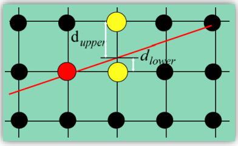
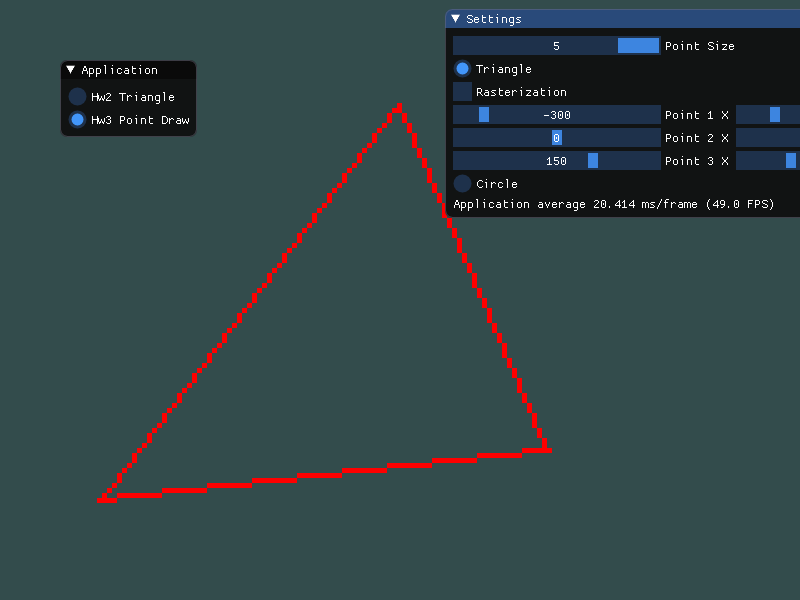
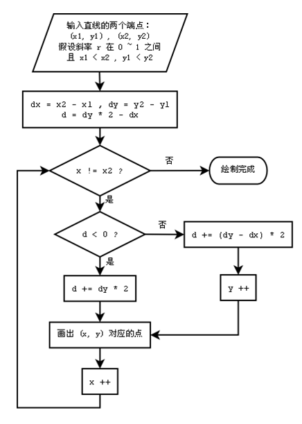
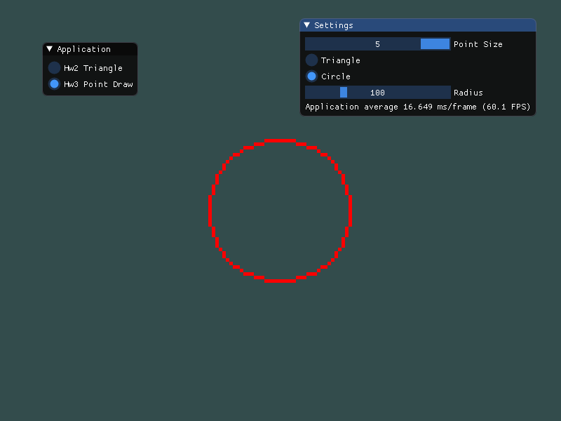
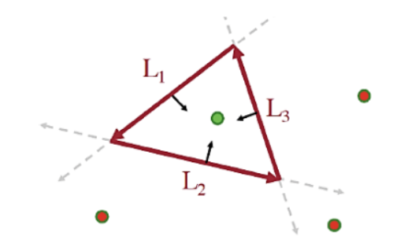
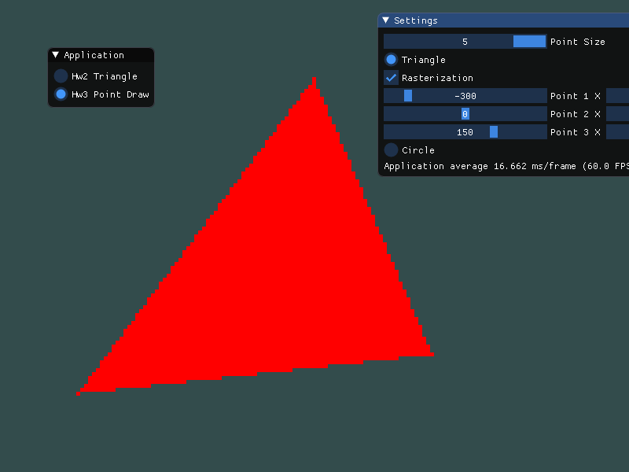

# Homework 3

姓名：陈秀嘉

学号：16340040

专业：软件工程(计算机应用)

## Basic

### 1. 使用Bresenham算法画一个三角形边框

Bresenham算法很简单，对于下面一幅图，如果$d_{upper} < d_{lower}$，那就取右上角的黄点；如果$d_{upper} \ge d_{lower}$，那就取右边的黄点。



我们可以令$p_i=\Delta x (d_{lower}-d_{upper})$，经过化简，可以得到以下的结论。

* 初始值$p_0=2 \Delta y - \Delta x$。
* 如果$p_i \le 0$，那下一个点取$(x_i+1,y_i)$，并计算得$p_{i+1} = p_i + 2\Delta y$。
* 如果$p_i > 0$，那下一个点取$(x_i + 1, y_i + 1)$，并计算得$p_{i+1}=p_i+2\Delta y - 2\Delta x$。
* 循环直到绘制完线。

首先我们声明一个由点组成的三角形类。

```c++
class PointDrawTriangle {
public:
	PointDrawTriangle(int points[6], int width, int height);
	~PointDrawTriangle();
	void draw();
	void set(int points[6]);
	void setAttr(int size, bool rasterization);

private:
	void add(int x, int y);

	int width; // 画布宽度
	int height; // 画布高度
	int pointSize = 1; // 点大小
	bool isRasterization = false; // 是否光栅化
	int count = 0; // 点的数量
	int points[6]; // 顶点的位置
	float* realPoints = nullptr; // 存储点数据
};
```

其中，我们指定画布的宽度、高度，然后按`[-width/2, width/2]`的区间取`x`坐标，按`[-height/2, height/2]`的区间取`y`坐标。这样，我们的点就都是整型坐标。

```c++
PointDrawTriangle::PointDrawTriangle(int points[6], int width, int height) {
	this->width = width;
	this->height = height;
	int size = width * height + 3 * width + 3 * height;
	realPoints = new float[size];
	set(points);
}

PointDrawTriangle::~PointDrawTriangle() {
	delete[] realPoints;
}
```

我们在该类的构造函数中根据画布的大小来决定点的空间。(这里分配了超出三角形点数量的空间，实际上也可以根据顶点的位置来计算点的数量，再分配)

接着，实现处理点的位置的函数。

```c++
void PointDrawTriangle::add(int x, int y) {
	realPoints[count++] = (float) x / (width / 2);
	realPoints[count++] = (float) y / (height / 2);
}
```

在`set`函数中，我们定义了Bresenham算法。

```c++
void PointDrawTriangle::set(int points[6]) {
	memmove(this->points, points, sizeof(int) * 6);
	count = 0;
	if (!isRasterization) {
		for (int i = 0; i < 3; i++) {
			int j = (i + 1) % 3;
			int x0 = points[i * 2], y0 = points[i * 2 + 1], x1 = points[j * 2], y1 = points[j * 2 + 1];
			bool reserve = std::abs(x0 - x1) < std::abs(y0 - y1);
			if (reserve) {
				std::swap(x0, y0);
				std::swap(x1, y1);
			}
			if (x0 > x1) {
				std::swap(x0, x1);
				std::swap(y0, y1);
			}
			int dy2 = 2 * std::abs(y1 - y0);
			int dy2_dx2 = dy2 - 2 * (x1 - x0);
			int p = dy2 - (x1 - x0);
			int step = y1 - y0 > 0 ? pointSize : -pointSize;
			for (int x = x0, y = y0; x < x1; x += pointSize) {
				if (p <= 0) {
					p = p + dy2;
				} else {
					p = p + dy2_dx2;
					y = y + step;
				}
				if (reserve) {
					add(y, x);
				} else {
					add(x, y);
				}
			}
		}
	} else {
		// code...
	}
}
```

当然，这里并不像算法描述那么简单，而是分成了4种情况。

* 当$\Delta y \le \Delta x$且两者为正，最简单的算法，按算法计算即可。
* 当$\Delta y > \Delta x$且两者为正，需要将x替换y，用y替换x，即取线段关于$y=x$对称的线段计算，计算出所有点再按$y=x$对称得到最终的点数据。
* 当$\Delta y$为负，取下一个点时，y值-1或不变；当$\Delta y$为正，取下一个点时，y值+1或不变。
* 当$\Delta x​$为负，需将线段的两个端点调换，然后重新计算。

为了方便显示Bresenham算法的效果，这里的坐标变化的步长取`pointSize`，而不是1。这个变量通过ImGui来控制其值，以实现实时改变点的大小。

```c++
void PointDrawTriangle::setAttr(int size, bool rasterization) {
	pointSize = size;
	isRasterization = rasterization;
	set(points);
}
```

接下来就是绘制三角形，我们可以在绘制前根据`pointSize`来修改点的大小，然后绘制完之后再把点的大小重置为1。

```c++
void PointDrawTriangle::draw() {
	unsigned int VAO, VBO;
	glGenVertexArrays(1, &VAO);
	glGenBuffers(1, &VBO);

	glBindVertexArray(VAO);
	glBindBuffer(GL_ARRAY_BUFFER, VBO);
	glBufferData(GL_ARRAY_BUFFER, sizeof(float) * count, realPoints, GL_STATIC_DRAW);
	glVertexAttribPointer(0, 2, GL_FLOAT, GL_FALSE, 2 * sizeof(float), (void*) 0);
	glEnableVertexAttribArray(0);
	glBindBuffer(GL_ARRAY_BUFFER, 0);

	glPointSize(pointSize);
	glDrawArrays(GL_POINTS, 0, count / 2);
	glBindVertexArray(0);
	glPointSize(1);

	glDeleteVertexArrays(1, &VAO);
	glDeleteBuffers(1, &VBO);
}
```

这里使用了一个接受`vec2`位置输入的着色器，因此绑定缓冲区时，只要设置每组数据的长度为`2*sizeof(float)`。

```c++
#version 450 core
layout (location = 0) in vec2 p;
uniform vec3 uniColor;
out vec3 outColor;

void main() {
	gl_Position = vec4(p.xy, 1.0, 1.0);
	outColor = uniColor;
}
```

接下来定义一些ImGui组件，用于修改一些属性。

```c++
if (ImGui::SliderInt("Point Size", &pointSize, 1, 5)) {
    triangle.setAttr(pointSize, rasterization);
    circle.setAttr(pointSize);
}
ImGui::RadioButton("Triangle", &objectType, 0);
if (objectType == 0) {
    if (ImGui::Checkbox("Rasterization", &rasterization)) {
        triangle.setAttr(pointSize, rasterization);
    }
    bool modify = false;
    modify |= ImGui::SliderInt("Point 1 X", points, -400, 400);
    ImGui::SameLine();
    modify |= ImGui::SliderInt("Point 1 Y", points + 1, -300, 300);
    modify |= ImGui::SliderInt("Point 2 X", points + 2, -400, 400);
    ImGui::SameLine();
    modify |= ImGui::SliderInt("Point 2 Y", points + 3, -300, 300);
    modify |= ImGui::SliderInt("Point 3 X", points + 4, -400, 400);
    ImGui::SameLine();
    modify |= ImGui::SliderInt("Point 3 Y", points + 5, -300, 300);
    if (modify) {
        triangle.set(points);
    }
}
```



### 2. 使用Bresenham算法画一个圆

由于圆的对称性，Bresenham画圆只需要计算八分之一的点，然后再根据圆点和半径即可得到其它部分的点。

这里，我们将取第一象限的$(0,r)$到$(\frac{\sqrt{2}}{2}r,\frac{\sqrt{2}}{2}r)$这一部分的点来计算。当然，我们需要将特殊点单独拿出来，不然就会重复计算多次点。

根据推导，可以得到下面的流程图。



跟三角形一样，首先声明一个由点组成的圆。

```c++
class PointDrawCircle {
public:
	PointDrawCircle(int radius, int width, int height);
	~PointDrawCircle();
	void draw();
	void set(int radius);
	void setAttr(int size);

private:
	void add(int x, int y);

	int width; // 画布宽度
	int height; // 画布高度
	int pointSize = 1; // 点大小
	int radius; // 半径
	int count = 0; // 点数量
	float* realPoints = nullptr; // 点数据
};
```

接着，实现Bresenham算法。

```c++
void PointDrawCircle::set(int radius) {
	this->radius = radius;
	count = 0;
	add(0, radius);
	add(0, -radius);
	add(radius, 0);
	add(-radius, 0);
	for (int x = 0, y = radius, d = 3 - 2 * radius; x <= y; x += pointSize) {
		if (d < 0) {
			d += 4 * x + 6;
		} else {
			d += 4 * x - 4 * y + 10;
			y -= pointSize;
		}
		add(x, y);
		add(x, -y);
		add(-x, y);
		add(-x, -y);
		add(y, x);
		add(y, -x);
		add(-y, x);
		add(-y, -x);
	}
}
```

接下来定义一些ImGui组件，用于修改一些属性。

```c++
if (ImGui::SliderInt("Point Size", &pointSize, 1, 5)) {
    triangle.setAttr(pointSize, rasterization);
    circle.setAttr(pointSize);
}
ImGui::RadioButton("Circle", &objectType, 1);
if (objectType == 1) {
    if (ImGui::SliderInt("Radius", &radius, 50, 250)) {
        circle.set(radius);
    }
}
```



### 3. 添加GUI修改参数

见1、2节中的代码。

## Bonus

### 1. 使用三角形光栅化转换算法，填充三角形

这里三角形光栅化我们选择Edge Equations法，即通过三条边所在的直线方程，来计算某个点是否在剩下一个顶点的一边。



对于顶点$P_1、P_2、P_3$，我们计算出线段$P_1P_2$所在直线$L_3$方程为$ax+by+c=0$，那么对于$P_3$和三角形内的一点$P_0$，必定满足函数$L(x,y)=ax+by+c$的值同符号，而对于$P_3$和三角形外的一点$P_4$，必定使得该函数值符号相反。

因此，我们可以根据这一特性，计算出该三角形的外接矩形中，哪个点在三角形外，哪个点在三角形内。

```c++
void PointDrawTriangle::set(int points[6]) {
	memmove(this->points, points, sizeof(int) * 6);
	count = 0;
	if (!isRasterization) {
		// code...
	} else {
		int minX = std::min({ points[0], points[2], points[4] });
		int minY = std::min({ points[1], points[3], points[5] });
		int maxX = std::max({ points[0], points[2], points[4] });
		int maxY = std::max({ points[1], points[3], points[5] });

		// (y2 - y1) * x + (x1 - x2) * y + (x2 * y1 - y2 * x1) = 0
		int a[3] = { 
			points[5] - points[3], // y2 - y1
			points[5] - points[1], // y2 - y0
			points[3] - points[1]  // y1 - y0
		};
		int b[3] = { 
			points[2] - points[4], // x1 - x2
			points[0] - points[4], // x0 - x2
			points[0] - points[2]  // x0 - x1
		};
		int c[3] = { 
			points[4] * points[3] - points[5] * points[2], // x2 * y1 - y2 * x1
			points[4] * points[1] - points[5] * points[0], // x2 * y0 - y2 * x0
			points[2] * points[1] - points[3] * points[0]  // x1 * y0 - y1 * x0
		};

        // 处理函数的系数，使得函数值小于零的点必定在三角形外
		for (int k = 0; k < 3; k++) {
			if (a[k] * points[k * 2] + b[k] * points[k * 2 + 1] + c[k] < 0) {
				a[k] = -a[k];
				b[k] = -b[k];
				c[k] = -c[k];
			}
		}

		for (int x = minX; x <= maxX; x += pointSize) {
			for (int y = minY; y <= maxY; y += pointSize) {
				bool flag = true;
				for (int k = 0; k < 3; k++) {
					if (a[k] * x + b[k] * y + c[k] < 0) {
						flag = false;
						break;
					}
				}
				if (flag) {
					add(x, y);
				}
			}
		}
	}
}
```



