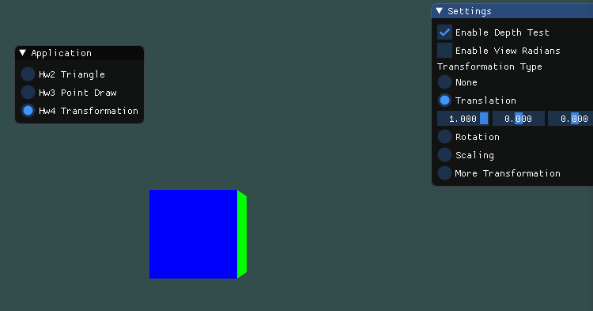

# Homework 4

姓名：陈秀嘉

学号：16340040

专业：软件工程(计算机应用)

## Basic

### 1. 画一个立方体

为了让局部坐标转换为标准坐标，我们定义了以下的变换方程。

$V_{clip}=M_{projection} \cdot M_{view} \cdot M_{model} \cdot V_{local}$

其中，使用了模型矩阵、观察矩阵、投影矩阵。投影矩阵用于实现透视效果，观察矩阵相当于摄像机，而模型矩阵就是对模型的位置的变换。

接下来，我们定义立方体的36个点。因为6个面，每个面由两个三角形组成，每个三角形3个点，一共36个点。这里直接使用了LearnOpenGL CN教材中的36个点的位置，并且，我们为每个面分配一种不同的颜色。

首先实现顶点着色器。

```glsl
#version 450 core
layout (location = 0) in vec3 p;
layout (location = 1) in vec3 c;

out vec3 outColor;

uniform mat4 model;
uniform mat4 view;
uniform mat4 projection;

void main() {
	gl_Position = projection * view * model * vec4(p, 1.0f);
	outColor = c;
}
```

然后绑定缓冲区。

```c++
glBindVertexArray(VAO[0]);
glBindBuffer(GL_ARRAY_BUFFER, VBO[0]);
glBufferData(GL_ARRAY_BUFFER, sizeof(vertices), vertices, GL_STATIC_DRAW);
glVertexAttribPointer(0, 3, GL_FLOAT, GL_FALSE, 6 * sizeof(float), (void*) 0);
glEnableVertexAttribArray(0);
glVertexAttribPointer(1, 3, GL_FLOAT, GL_FALSE, 6 * sizeof(float), (void*) (3 * sizeof(float)));
glEnableVertexAttribArray(1);
glBindBuffer(GL_ARRAY_BUFFER, 0);
glBindVertexArray(0);
```

设置模型矩阵、观察矩阵、投影矩阵，实现立方体的绘制。

```c++
shader.use();
glm::mat4 projection = glm::mat4(1.0f);
projection = glm::perspective(glm::radians(45.0f), (float) 800 / (float) 600, 0.1f, 100.0f);
shader.setGlmMat4("projection", projection);

glm::mat4 model = glm::mat4(1.0f);
glm::mat4 view = glm::mat4(1.0f);
view = glm::translate(view, glm::vec3(0.0f, 0.0f, -7.0f));

shader.setGlmMat4("model", model);
shader.setGlmMat4("view", view);

glBindVertexArray(VAO[0]);
glDrawArrays(GL_TRIANGLES, 0, 36);
glBindVertexArray(0);
```

然后编译运行，得到一个立方体。


为了方便观察，我们将观察矩阵设置为具有一个角度。

```c++
if (enableViewRadians) {
    view = glm::rotate(view, glm::radians(-45.0f), glm::vec3(-1.0f, 1.0f, 0.0f));
}
```


可以观察到，深度测试并没有开启。接下来实现按钮控制深度测试的开启。

```c++
ImGui::Checkbox("Enable Depth Test", &enableDepthTest);
if (enableDepthTest) {
    glEnable(GL_DEPTH_TEST);
} else {
    glDisable(GL_DEPTH_TEST);
}
```

同时，需要在每次循环过程中清除Z缓冲。

```c++
glClear(GL_COLOR_BUFFER_BIT | GL_DEPTH_BUFFER_BIT);
```

开启深度测试之后的效果如下：


在深度测试未开启的环境下，部分片段的颜色会覆盖掉其它片段的颜色，而没有考虑到它们的位置影响，也就是片段的深度。因为顶点着色器只将颜色的RGB传递给片段着色器，颜色的深度信息是存储在Z缓冲中。在输出颜色时，只有将该颜色的深度值与Z缓冲对比，才能正确显示颜色。否则，按点的顺序来绘制颜色，会导致颜色被错误覆盖。

### 2. 平移

我们首先声明平移所需要的变量。

```c++
float translation = 0.0f;
float translationStep = 0.05f;
float translationVec3[3] = { 1.0f, 0.0f, 0.0f };
```

然后实现平移。

```c++
glm::mat4 model = glm::mat4(1.0f);
glm::mat4 view = glm::mat4(1.0f);

model = glm::translate(model, glm::vec3(translation * translationVec3[0], translation * translationVec3[1], translation * translationVec3[2]));
translation += translationStep;
if (std::abs(translation - 2.0f) < 1e-6 || std::abs(translation + 2.0f) < 1e-6) {
    translationStep = -translationStep;
}

view = glm::translate(view, glm::vec3(0.0f, 0.0f, -7.0f));
if (enableViewRadians) {
    view = glm::rotate(view, glm::radians(-45.0f), glm::vec3(-1.0f, 1.0f, 0.0f));
}

shader.setGlmMat4("model", model);
shader.setGlmMat4("view", view);
```

设置平移向量为(1, 0, 0)，即可实现沿x轴平移的立方体。




打开视角角度，可得到下面的效果。


### 3. 旋转

旋转只需要声明一个向量用来控制旋转轴的位置，至于角度我们用glfwGetTime来获得。

```c++
float rotationVec3[3] = { 1.0f, 0.0f, 1.0f };
```

然后实现旋转。

```c++
glm::mat4 model = glm::mat4(1.0f);
glm::mat4 view = glm::mat4(1.0f);

model = glm::rotate(model, (float) glfwGetTime(), glm::vec3(rotationVec3[0], rotationVec3[1], rotationVec3[2]));

view = glm::translate(view, glm::vec3(0.0f, 0.0f, -7.0f));
if (enableViewRadians) {
    view = glm::rotate(view, glm::radians(-45.0f), glm::vec3(-1.0f, 1.0f, 0.0f));
}

shader.setGlmMat4("model", model);
shader.setGlmMat4("view", view);
```

以下为效果。


### 4. 放缩

放缩需要声明放缩因子和步长，这里我们默认xyz都放缩，不提供向量用来控制放缩的维度和比例。

```c++
float scale = 1.0f;
float scaleStep = 0.05f;
```

然后实现放缩。

```c++
glm::mat4 model = glm::mat4(1.0f);
glm::mat4 view = glm::mat4(1.0f);

model = glm::scale(model, glm::vec3(scale));
scale += scaleStep;
if (std::abs(scale - 5.0f) < 1e-6 || std::abs(scale - 0.5f) < 1e-6) {
    scaleStep = -scaleStep;
}

view = glm::translate(view, glm::vec3(0.0f, 0.0f, -7.0f));
if (enableViewRadians) {
    view = glm::rotate(view, glm::radians(-45.0f), glm::vec3(-1.0f, 1.0f, 0.0f));
}

shader.setGlmMat4("model", model);
shader.setGlmMat4("view", view);
```

以下为效果。


### 5. GUI

```c++
ImGui::Begin("Settings", NULL, ImGuiWindowFlags_AlwaysAutoResize);
ImGui::Checkbox("Enable Depth Test", &enableDepthTest);
ImGui::Checkbox("Enable View Radians", &enableViewRadians);
if (enableDepthTest) {
    glEnable(GL_DEPTH_TEST);
} else {
    glDisable(GL_DEPTH_TEST);
}
ImGui::Text("Transformation Type");
ImGui::RadioButton("None", &transformType, 0);
ImGui::RadioButton("Translation", &transformType, 1);
if (transformType == 1) {
    ImGui::SliderFloat3("Vector3", translationVec3, -1.0f, 1.0f);
}
ImGui::RadioButton("Rotation", &transformType, 2);
if (transformType == 2) {
    ImGui::SliderFloat3("Vector3", rotationVec3, -1.0f, 1.0f);
}
ImGui::RadioButton("Scaling", &transformType, 3);
ImGui::RadioButton("More Transformation", &transformType, 4);
ImGui::End();
```

### 6. 渲染管线

渲染管线就是GPU内部的并行处理单元，其并行效果可以使得渲染呈流水线效果。每个单独的处理单元都可以处理每种着色器，比如顶点着色器、片段着色器等。这样就可以使得并不是Vertex Shader处理完了所有数据之后才调用Fragment Shader，而是流水线执行的方式，加快了渲染的效率。

简单地说，渲染管线就是执行GLSL语法编写的Shader代码的执行单元。一般情况下，GPU内部有多个这种单元，组成流水线。

## Bonus

### 1. 地球绕太阳

将平移、旋转、放缩组合起来也不复杂。这里我们实现一个地球绕太阳公转，然后地球自己自转的动画效果。实现公转很简单，只要先实现旋转，然后平移，即可实现。

```c++
glm::mat4 model = glm::mat4(1.0f);
model = glm::scale(model, glm::vec3(0.2f, 0.2f, 0.2f));
model = glm::rotate(model, (float) glfwGetTime(), glm::vec3(0.0f, 1.0f, 0.0f));
model = glm::translate(model, glm::vec3(15.0f, 0, 0));
shader.setGlmMat4("model", model);
```

实现自转，可以再加上一次旋转动画。

```c++
glm::mat4 model = glm::mat4(1.0f);
model = glm::scale(model, glm::vec3(0.2f, 0.2f, 0.2f));
model = glm::rotate(model, (float) glfwGetTime(), glm::vec3(0.0f, 1.0f, 0.0f));
model = glm::translate(model, glm::vec3(15.0f, 0, 0));
model = glm::rotate(model, 10 * (float) glfwGetTime(), glm::vec3(0.0f, 1.0f, 0.0f));
shader.setGlmMat4("model", model);
```

然后即可实现地球绕太阳转的效果。

为了加上放缩，我们就实现一个可以放大缩小的太阳就好了。

```c++
model = glm::scale(model, glm::vec3(moreScale));
moreScale += moreScaleStep;
if (std::abs(moreScale - 1.0f) < 1e-6 || std::abs(moreScale - 0.6f) < 1e-6) {
    moreScaleStep = -moreScaleStep;
}
```

因为这里涉及了两个物体，我们可以再创建一个VAO和VBO，然后先绘制一个物体，再绘制另一个物体。

```c++
glBindVertexArray(VAO[0]);
glDrawArrays(GL_TRIANGLES, 0, 36);
glBindVertexArray(0);

if (transformType == 4) {
    // more code

    glBindVertexArray(VAO[1]);
    glDrawArrays(GL_TRIANGLES, 0, 36);
    glBindVertexArray(0);
}
```

最终效果如下：


## Update v1

由于作业要求实现的立方体边长为4，所以将Learing OpenGL的立方体顶点数据中的0.5均改成2.0。然后将model矩阵缩小4分之一，并且修改地球的平移距离。

```c++
glm::mat4 model = glm::scale(glm::mat4(1.0f), glm::vec3(0.25f));
```

```c++
if (transformType == 4) {
    glm::mat4 model = glm::scale(glm::mat4(1.0f), glm::vec3(0.25f));
    model = glm::scale(model, glm::vec3(0.2f, 0.2f, 0.2f));
    model = glm::rotate(model, (float) glfwGetTime(), glm::vec3(0.0f, 1.0f, 0.0f));
    // 原来为15.0f，现改为4倍
    model = glm::translate(model, glm::vec3(60.0f, 0, 0));
    model = glm::rotate(model, 10 * (float) glfwGetTime(), glm::vec3(0.0f, 1.0f, 0.0f));
    shader.setGlmMat4("model", model);

    glBindVertexArray(VAO[1]);
    glDrawArrays(GL_TRIANGLES, 0, 36);
    glBindVertexArray(0);
}
```

