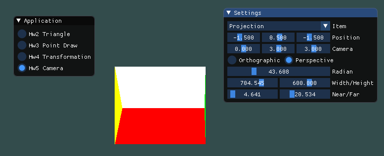

# Homework 5

## Basic

### 1. 投影

首先，将上次作业绘制的立方体放置在特定的位置。我们通过ImGui来设置这个位置的具体坐标。

```c++
glm::mat4 model = glm::scale(glm::mat4(1.0f), glm::vec3(0.25f));
model = glm::translate(model, glm::vec3(position[0], position[1], position[2]));
shader.setGlmMat4("model", model);
```

对于正交投影，我们也使用ImGui来设置参数，同时使用glm来实现正交投影。

```c++
glm::mat4 projection = glm::ortho(window[0], window[1], window[2], window[3], windowDis[0], windowDis[1]);
shader.setGlmMat4("projection", projection);
```

对于透视投影，我们也使用ImGui来设置参数，同时使用glm来实现透视投影。

```c++
glm::mat4 projection = glm::perspective(glm::radians(radian[0]), radian[1] / radian[2], windowDis[0], windowDis[1]);
shader.setGlmMat4("projection", projection);
```

通过ImGui来设置摄像头参数。

```c++
glm::mat4 view = glm::lookAt(glm::vec3(cameraPosition[0], cameraPosition[1], cameraPosition[2]), glm::vec3(0.0f, 0.0f, 0.0f), glm::vec3(0.0f, 1.0f, 0.0f));
shader.setGlmMat4("view", view);
```

正交投影效果如下：


通过修改参数，可以观察到，left、right、bottom、top影响投影的窗口，而near和far影响投影距离。当near调大或far调小时，会导致物体某部分直接被截取，而无法投影出来。

透视投影效果如下：




通过修改参数，可以观察到，width、height影响投影的窗口，修改会使得立方体发生形变。而Radian影响的时摄像机的摄影角度。修改near和far的效果如同正交投影。

### 2. 视角变换

这里使用透视投影，然后通过当前时间来计算摄像机的X、Z坐标，其中Y坐标设为0。然后设置投影、视图、物体三个矩阵，即可实现摄像机绕立方体旋转的效果。

```c++
glm::mat4 projection = glm::perspective(glm::radians(45.0f), 800.0f / 600.0f, 0.1f, 100.0f);
float camX = std::sin(glfwGetTime()) * cameraRadius;
float camZ = std::cos(glfwGetTime()) * cameraRadius;
glm::mat4 view = glm::lookAt(glm::vec3(camX, 0.0f, camZ), glm::vec3(0.0f, 0.0f, 0.0f), glm::vec3(0.0f, 1.0f, 0.0f));
glm::mat4 model = glm::scale(glm::mat4(1.0f), glm::vec3(0.25f));
shader.setGlmMat4("projection", projection);
shader.setGlmMat4("view", view);
shader.setGlmMat4("model", model);
```

效果图如下：


### 3. 在GUI中添加菜单栏

首先，实现一个Combo，然后对于Combo中的每一项分别实现各自的GUI菜单。(GUI效果可见上两节)

```c++
ImGui::Begin("Settings", NULL, ImGuiWindowFlags_AlwaysAutoResize);
static const char* itemHeader[3] = { "Projection", "View Changing", "First Person Shooting" };
ImGui::Combo("Item", &item, itemHeader, 3);
if (item == 0) {
    ImGui::SliderFloat3("Position", position, -5.0f, 5.0f);
    ImGui::SliderFloat3("Camera", cameraPosition, -100.0f, 100.0f);
    ImGui::RadioButton("Orthographic", &projectionType, 0);
    ImGui::SameLine();
    ImGui::RadioButton("Perspective", &projectionType, 1);
    if (projectionType == 0) {
        ImGui::SliderFloat4("Left/Right/Bottom/Top", window, -10.0f, 10.0f);
    } else {
        ImGui::SliderFloat("Radian", radian, 0.0f, 180.0f);
        ImGui::SliderFloat2("Width/Height", radian + 1, 0.0f, 1000.0f);
    }
    ImGui::SliderFloat2("Near/Far", windowDis, 0.1f, 100.0f);
} else if (item == 1) {
    ImGui::SliderFloat("Camera Radian", &cameraRadius, 0.0f, 20.0f);
}
ImGui::End();
```

### 4. ModelView矩阵和View矩阵、Model矩阵

OpenGL通常渲染需要Model矩阵、View矩阵、Projection矩阵，前两者可以合并成ModelView矩阵，因为渲染可以分为几何变换和投影变换。Model矩阵、View矩阵用于几何变换，Projection矩阵用于投影变换。

但是我觉得实际上OpenGL更多时候是区分Model矩阵和View矩阵的，因为View矩阵可用于表示摄像机的位置、上方向、目标。如果在电影渲染或者别的场景，可能有多个摄像机，因此区分Model、View矩阵是有意义的。

## Bonus

### 1. 实现Camera类

首先，声明一个Camera类。

```c++
class Camera {
public:
    Camera(glm::vec3 position = glm::vec3(0.0f, 0.0f, 0.0f), glm::vec3 worldUp = glm::vec3(0.0f, 1.0f, 0.0f), float yaw = -90.0f, float pitch = 0.0f);

    enum Movement {
        Forward, Backward, Left, Right
    };

    glm::mat4 getProjection();
    glm::mat4 getView();
    void input(Movement dir, float time);
    void input(float xOffset, float yOffset, bool constrainPitch = true);
    void input(float zOffset);

private:
    void update();

    glm::vec3 position;
    glm::vec3 front;
    glm::vec3 up;
    glm::vec3 right;
    glm::vec3 worldUp;
    float yaw;
    float pitch;
    float zoom;

    float speed;
    float mouseSensitivity;
};
```

我们需要摄像机处理三类输入：键盘输入、鼠标移动、鼠标滚轮滚动。

```c++
void Camera::input(Movement dir, float time) {
    float velocity = speed * time;
    switch (dir) {
    case Camera::Forward:
        position += front * velocity;
        break;
    case Camera::Backward:
        position -= front * velocity;
        break;
    case Camera::Left:
        position -= right * velocity;
        break;
    case Camera::Right:
        position += right * velocity;
        break;
    default:
        break;
    }
}

void Camera::input(float xOffset, float yOffset, bool constrainPitch) {
    yaw += xOffset * mouseSensitivity;
    pitch += yOffset * mouseSensitivity;
    if (constrainPitch) {
        if (pitch > 89.0f) pitch = 89.0f;
        if (pitch < -89.0f) pitch = -89.0f;
    }
    update();
}

void Camera::input(float zOffset) {
    if (zoom >= 1.0f && zoom <= 45.0f) zoom -= zOffset;
    if (zoom <= 1.0f) zoom = 1.0f;
    if (zoom >= 45.0f) zoom = 45.0f;
}
```

可使用摄像机类获取当前的Projection矩阵和View矩阵。

```c++
glm::mat4 Camera::getProjection() {
    return glm::perspective(glm::radians(zoom), 800.0f / 600.0f, 0.1f, 100.0f);
}

glm::mat4 Camera::getView() {
    return glm::lookAt(position, position + front, up);
}
```

当鼠标移动时，摄像机类需要更新参数。

```c++
void Camera::update() {
    front.x = std::cos(glm::radians(yaw)) * std::cos(glm::radians(pitch));
    front.y = std::sin(glm::radians(pitch));
    front.z = std::sin(glm::radians(yaw)) * std::cos(glm::radians(pitch));
    front = glm::normalize(front);
    right = glm::normalize(glm::cross(front, worldUp));
    up = glm::normalize(glm::cross(right, front));
}
```

效果如下：


