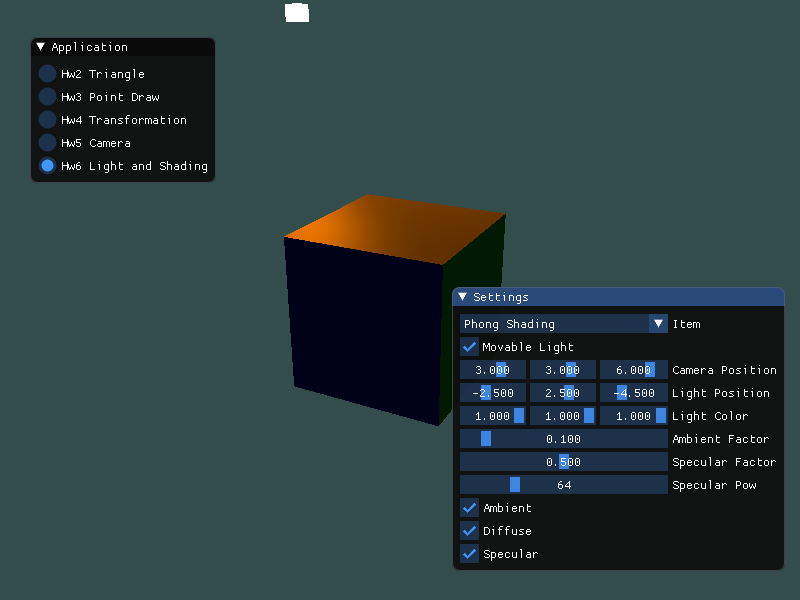

# Homework 6

## Basic

### 1. 实现Phong、Gouraud光照模型

首先，我们继续使用上一次作业的立方体。不过，为了实现光照模型，我们需要添加一个vec3存储点所在平面的法向量。

```c++
float vertices[324] = {
    -2.0f, -2.0f, -2.0f, 1.0f, 1.0f, 1.0f,  0.0f,  0.0f, -1.0f,
    2.0f, -2.0f, -2.0f, 1.0f, 1.0f, 1.0f,  0.0f,  0.0f, -1.0f,
    2.0f,  2.0f, -2.0f, 1.0f, 1.0f, 1.0f,  0.0f,  0.0f, -1.0f,
    2.0f,  2.0f, -2.0f, 1.0f, 1.0f, 1.0f,  0.0f,  0.0f, -1.0f,
    -2.0f,  2.0f, -2.0f, 1.0f, 1.0f, 1.0f,  0.0f,  0.0f, -1.0f,
    -2.0f, -2.0f, -2.0f, 1.0f, 1.0f, 1.0f,  0.0f,  0.0f, -1.0f,

    // more vertices

    -2.0f,  2.0f, -2.0f, 1.0f, 0.5f, 0.0f,  0.0f,  1.0f,  0.0f,
    2.0f,  2.0f, -2.0f, 1.0f, 0.5f, 0.0f,  0.0f,  1.0f,  0.0f,
    2.0f,  2.0f,  2.0f, 1.0f, 0.5f, 0.0f,  0.0f,  1.0f,  0.0f,
    2.0f,  2.0f,  2.0f, 1.0f, 0.5f, 0.0f,  0.0f,  1.0f,  0.0f,
    -2.0f,  2.0f,  2.0f, 1.0f, 0.5f, 0.0f,  0.0f,  1.0f,  0.0f,
    -2.0f,  2.0f, -2.0f, 1.0f, 0.5f, 0.0f,  0.0f,  1.0f,  0.0f
};
```

然后需要实现Phong Shading的顶点着色器。

```glsl
#version 450 core
layout (location = 0) in vec3 p;
layout (location = 1) in vec3 c;
layout (location = 2) in vec3 n;

out vec3 outPos;
out vec3 outColor;
out vec3 outNorm;

uniform mat4 model;
uniform mat4 view;
uniform mat4 projection;

void main() {
	gl_Position = projection * view * model * vec4(p, 1.0f);
    outPos = vec3(model * vec4(p, 1.0f));
    outColor = c;
    outNorm = n;
}
```

因为片段着色器绘制颜色时，需要知道点的位置、原始颜色、点所在平面的法向量，然后通过这些信息和光照的位置等信息来计算该点的真实颜色。所以我们需要输出`outPos`、`outColor`、`outNorm`，需要注意由于输入的`p`是物体自身坐标系的坐标，需要使用`model`矩阵转换成世界坐标系的坐标。

对于片段着色器，其主要工作是根据现有的信息，计算该点的真实颜色。

```glsl
#version 450 core
in vec3 outPos;
in vec3 outColor;
in vec3 outNorm;

out vec4 FragColor;

uniform vec3 lightColor;
uniform vec3 lightPos;
uniform vec3 viewPos;
uniform bool needAmbient;
uniform bool needDiffuse;
uniform bool needSpecular;
uniform float ambientFactor;
uniform float specularFactor;
uniform int specularPow;

void main() {
    vec3 ambient = ambientFactor * lightColor;
    
    vec3 norm = normalize(outNorm);
    vec3 lightDir = normalize(lightPos - outPos);
    float diff = max(dot(norm, lightDir), 0.0f);
    vec3 diffuse = diff * lightColor;

    vec3 viewDir = normalize(viewPos - outPos);
    vec3 reflectDir = reflect(-lightDir, norm);
    float spec = pow(max(dot(viewDir, reflectDir), 0.0f), specularPow);
    vec3 specular = specularFactor * spec * lightColor;

    vec3 factor = vec3(0.0f);
    if (needAmbient) factor += ambient;
    if (needDiffuse) factor += diffuse;
    if (needSpecular) factor += specular;
    FragColor = vec4(factor * outColor, 1.0f);
}
```

Phong光照模型将光照分为环境光照、漫反射光照、镜面反射光照三类，它们共同作用于物体使物体产生真实的颜色。上面的代码可以观察到，环境光照生成的颜色由ambient因子和光源自身的颜色决定。漫反射光照取决于光源颜色、光源与物体的距离，而镜面反射光照取决于specular因子、光源与物体的距离、摄像机与物体的距离等。

为了方便观察三种光照的效果，我们声明了三个uniform布尔变量，用于判断是否生成最终颜色时考虑哪种光照。

对于立方体，首先创建存储顶点信息的VAO和VBO。

```c++
glGenVertexArrays(1, &VAO);
glGenBuffers(1, &VBO);

glBindVertexArray(VAO);
glBindBuffer(GL_ARRAY_BUFFER, VBO);
glBufferData(GL_ARRAY_BUFFER, sizeof(vertices), vertices, GL_STATIC_DRAW);
glVertexAttribPointer(0, 3, GL_FLOAT, GL_FALSE, 9 * sizeof(float), (void*) 0);
glEnableVertexAttribArray(0);
glVertexAttribPointer(1, 3, GL_FLOAT, GL_FALSE, 9 * sizeof(float), (void*) (3 * sizeof(float)));
glEnableVertexAttribArray(1);
glVertexAttribPointer(2, 3, GL_FLOAT, GL_FALSE, 9 * sizeof(float), (void*) (6 * sizeof(float)));
glEnableVertexAttribArray(2);
glBindBuffer(GL_ARRAY_BUFFER, 0);
glBindVertexArray(0);
```

然后初始化一些uniform全局变量。

```c++
glm::mat4 projection = glm::perspective(glm::radians(45.0f), 800.0f / 600.0f, 0.1f, 100.0f);
shader.use();
shader.setBool("needAmbient", true);
shader.setBool("needDiffuse", true);
shader.setBool("needSpecular", true);
shader.setFloat("ambientFactor", ambientFactor);
shader.setFloat("specularFactor", specularFactor);
shader.setInt("specularPow", specularPow);
shader.setGlmMat4("projection", projection);
```

接下来绘制立方体。

```c++
glm::vec3 color = glm::vec3(lightColor[0], lightColor[1], lightColor[2]);
glm::vec3 pos = glm::vec3(lightPosition[0], lightPosition[1], lightPosition[2]);
glm::vec3 cameraPos = glm::vec3(cameraPosition[0], cameraPosition[1], cameraPosition[2]);
glm::mat4 view = glm::lookAt(cameraPos, glm::vec3(0.0f, 0.0f, 0.0f), glm::vec3(0.0f, 1.0f, 0.0f));
glm::mat4 model = glm::scale(glm::mat4(1.0f), glm::vec3(0.4f));

shader.use();
shader.setGlmVec3("lightPos", pos);
shader.setGlmVec3("lightColor", color);
shader.setGlmVec3("viewPos", cameraPos);
shader.setGlmMat4("view", view);
shader.setGlmMat4("model", model);

glEnable(GL_DEPTH_TEST);
glBindVertexArray(VAO);
glDrawArrays(GL_TRIANGLES, 0, 36);
glBindVertexArray(0);
```

接下来我们需要绘制光源，光源我们也使用立方体表示，可以直接使用上面立方体的VAO和VBO。不过，我们要创建一个新的Shader，因为光源的顶点着色器和片段着色器和绘制普通物体不一样。因为使用了同一个VAO和VBO，那顶点着色器我们继续沿用上述的顶点着色器，而片段着色器我们改为绘制指定uniform的颜色。

```glsl
#version 450 core

out vec4 FragColor;

uniform vec3 lightColor;

void main() {
    FragColor = vec4(lightColor.rgb, 1.0f);
}
```

我们将顶点着色器传递的变量全都丢弃了，光源的颜色指定为uniform变量`lightColor`。因此对于这个新的Shader，我们要设置uniform变量。

```c++
glm::vec3 color = glm::vec3(lightColor[0], lightColor[1], lightColor[2]);

lightShader.use();
lightShader.setGlmVec3("lightColor", color);
```

接下来就可以绘制光源了。

```c++
lightShader.use();
model = glm::translate(glm::mat4(1.0f), pos);
model = glm::scale(model, glm::vec3(0.0625f));
lightShader.setGlmMat4("view", view);
lightShader.setGlmMat4("model", model);

glBindVertexArray(VAO);
glDrawArrays(GL_TRIANGLES, 0, 36);
glBindVertexArray(0);
```

下图为Phong光照模型的效果。


接下来我们实现Gouraud光照模型。Gouraud和Phong的区别在于前者的颜色计算是在顶点着色器实现，而后者是在片段着色器实现。

因此我们仅需要简单地将片段着色器的源码复制粘贴到顶点着色器。

```glsl
#version 450 core
layout (location = 0) in vec3 p;
layout (location = 1) in vec3 c;
layout (location = 2) in vec3 n;

out vec3 outColor;

uniform mat4 model;
uniform mat4 view;
uniform mat4 projection;

uniform vec3 lightColor;
uniform vec3 lightPos;
uniform vec3 viewPos;
uniform bool needAmbient;
uniform bool needDiffuse;
uniform bool needSpecular;
uniform float ambientFactor;
uniform float specularFactor;
uniform int specularPow;

void main() {
	gl_Position = projection * view * model * vec4(p, 1.0f);

    vec3 outPos = vec3(model * vec4(p, 1.0));
    vec3 outNorm = mat3(transpose(inverse(model))) * n;

    vec3 ambient = ambientFactor * lightColor;
    
    vec3 norm = normalize(outNorm);
    vec3 lightDir = normalize(lightPos - outPos);
    float diff = max(dot(norm, lightDir), 0.0f);
    vec3 diffuse = diff * lightColor;

    vec3 viewDir = normalize(viewPos - outPos);
    vec3 reflectDir = reflect(-lightDir, norm);
    float spec = pow(max(dot(viewDir, reflectDir), 0.0f), specularPow);
    vec3 specular = specularFactor * spec * lightColor;

    vec3 factor = vec3(0.0f);
    if (needAmbient) factor += ambient;
    if (needDiffuse) factor += diffuse;
    if (needSpecular) factor += specular;
    outColor = factor * c;
}
```

而片段着色器，可以使用上几次作业用到的最简单的片段着色器实现。

```glsl
#version 450 core
in vec3 outColor;

out vec4 FragColor;

void main() {
	FragColor = vec4(outColor.rgb, 1.0f);
}
```

与Phong光照模型一样，简单地设置uniform即可实现绘制。

```c++
// init
gouraudShader.use();
gouraudShader.setBool("needAmbient", true);
gouraudShader.setBool("needDiffuse", true);
gouraudShader.setBool("needSpecular", true);
gouraudShader.setFloat("ambientFactor", ambientFactor);
gouraudShader.setFloat("specularFactor", specularFactor);
gouraudShader.setInt("specularPow", specularPow);
gouraudShader.setGlmMat4("projection", projection);

// draw
glm::vec3 color = glm::vec3(lightColor[0], lightColor[1], lightColor[2]);
glm::vec3 pos = glm::vec3(lightPosition[0], lightPosition[1], lightPosition[2]);
glm::vec3 cameraPos = glm::vec3(cameraPosition[0], cameraPosition[1], cameraPosition[2]);
glm::mat4 view = glm::lookAt(cameraPos, glm::vec3(0.0f, 0.0f, 0.0f), glm::vec3(0.0f, 1.0f, 0.0f));
glm::mat4 model = glm::scale(glm::mat4(1.0f), glm::vec3(0.4f));

gouraudShader.use();
gouraudShader.setGlmVec3("lightPos", pos);
gouraudShader.setGlmVec3("lightColor", color);
gouraudShader.setGlmVec3("viewPos", cameraPos);
gouraudShader.setGlmMat4("view", view);
gouraudShader.setGlmMat4("model", model);

glEnable(GL_DEPTH_TEST);
glBindVertexArray(VAO);
glDrawArrays(GL_TRIANGLES, 0, 36);
glBindVertexArray(0);
```


对比两种光照模型，Phong的颜色计算是在片段着色器中实现的，因为需要计算出片段中各点的颜色，因此效率会比较低，但是Phong的光照效果要好。Phong可以很简单地得到很明显的光照效果，比如下面的图。


但是同样效果的Gouraud是下图的，完全看不出镜面反射的效果。


Gouraud实际上就是在顶点着色器上实现的Phong光照模型，因为顶点着色器传递给片段着色器的是顶点的颜色，实际上Gouraud的光照效果是通过片段中的顶点进行颜色插值计算出来的。因此Gouraud的效率很高，但是效果不如Phong，尤其是在顶点少而光照场景复杂的情况。

上图就是因为三角形的顶点均被计算成相近的颜色，因此几乎看不到效果。

### 2. 使用GUI，使参数可调节，效果实时更改

声明多个变量，用于控制Shader的参数。

```c++
int item = 0;
bool moveable = false;
bool needAmbient = true;
bool needDiffuse = true;
bool needSpecular = true;
float ambientFactor = 0.1f;
float specularFactor = 0.5f;
int specularPow = 64;

float cameraPosition[3] = { 3.0f, 3.0f, 6.0f };
float lightPosition[3] = { -2.5f, 2.5f, -4.5f };
float lightColor[3] = { 1.0f, 1.0f, 1.0f };
```

然后使用ImGui控制这些参数。

```c++
ImGui::Begin("Settings", NULL, ImGuiWindowFlags_AlwaysAutoResize);
static const char* itemHeader[2] = { "Phong Shading", "Gouraud Shading"};
ImGui::Combo("Item", &item, itemHeader, 2);
ImGui::Checkbox("Movable Light", &moveable);
ImGui::SliderFloat3("Camera Position", cameraPosition, -10.0f, 10.0f);
ImGui::SliderFloat3("Light Position", lightPosition, -10.0f, 10.0f);
ImGui::SliderFloat3("Light Color", lightColor, 0.0f, 1.0f);
if (ImGui::SliderFloat("Ambient Factor", &ambientFactor, 0.0f, 1.0f)) {
    shader.use();
    shader.setFloat("ambientFactor", ambientFactor);
    gouraudShader.use();
    gouraudShader.setFloat("ambientFactor", ambientFactor);
}
if (ImGui::SliderFloat("Specular Factor", &specularFactor, 0.0f, 1.0f)) {
    shader.use();
    shader.setFloat("specularFactor", specularFactor);
    gouraudShader.use();
    gouraudShader.setFloat("specularFactor", specularFactor);
}
if (ImGui::SliderInt("Specular Pow", &specularPow, 1, 256)) {
    shader.use();
    shader.setInt("specularPow", specularPow);
    gouraudShader.use();
    gouraudShader.setInt("specularPow", specularPow);
}
if (ImGui::Checkbox("Ambient", &needAmbient)) {
    shader.use();
    shader.setBool("needAmbient", needAmbient);
    gouraudShader.use();
    gouraudShader.setBool("needAmbient", needAmbient);
}
if (ImGui::Checkbox("Diffuse", &needDiffuse)) {
    shader.use();
    shader.setBool("needDiffuse", needDiffuse);
    gouraudShader.use();
    gouraudShader.setBool("needDiffuse", needDiffuse);
}
if (ImGui::Checkbox("Specular", &needSpecular)) {
    shader.use();
    shader.setBool("needSpecular", needSpecular);
    gouraudShader.use();
    gouraudShader.setBool("needSpecular", needSpecular);
}
ImGui::End();
```

接下来只要将绘制的源码的常量替换为以上的变量即可。

## Bonus

### 1. 使光源在场景中来回移动

我们可以设置一个绕y轴旋转的光源，它的半径可以设为实时通过光源的x和z轴计算，这样即可在改变光源的位置时改变其轨迹的半径。

```c++
float lightRadius = std::sqrt(lightPosition[0] * lightPosition[0] + lightPosition[2] * lightPosition[2]);
float lightX = std::sin(glfwGetTime()) * lightRadius;
float lightZ = std::cos(glfwGetTime()) * lightRadius;
pos = glm::vec3(lightX, lightPosition[1], lightZ);
```

`pos`即为光源的位置，然后设置uniform变量。

```c++
shader.use();
shader.setGlmVec3("lightPos", pos);
```

对于光源的绘制也需要适当改一下。

```c++
lightShader.use();
model = glm::translate(glm::mat4(1.0f), pos);
model = glm::scale(model, glm::vec3(0.0625f));
lightShader.setGlmVec3("lightColor", color);
lightShader.setGlmMat4("view", view);
lightShader.setGlmMat4("model", model);
```




