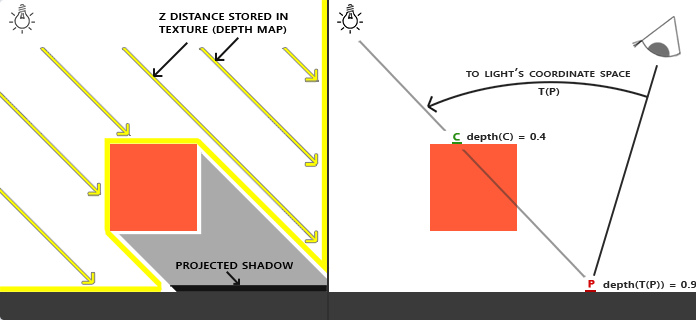
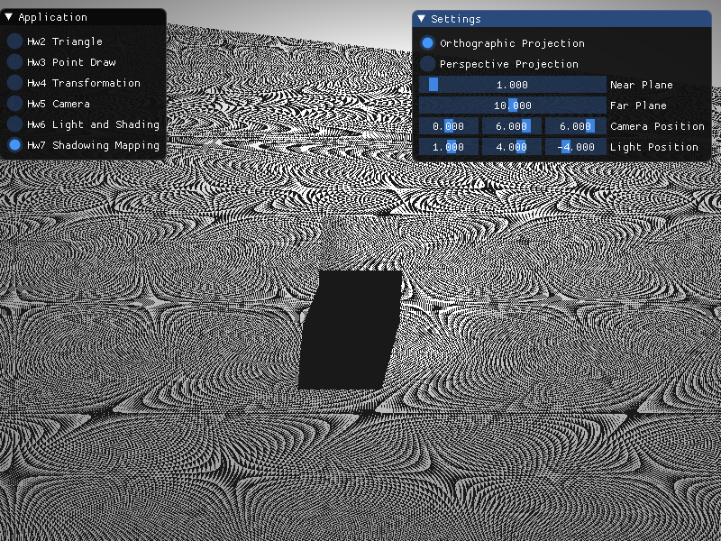
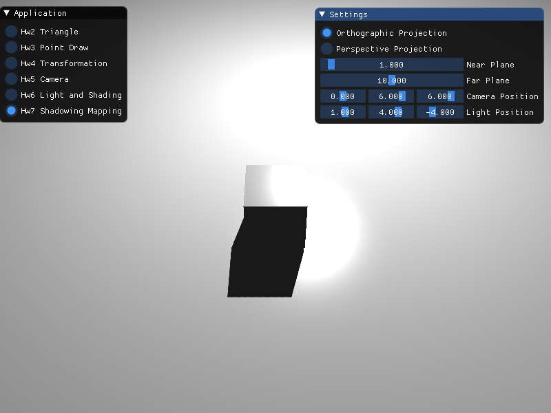
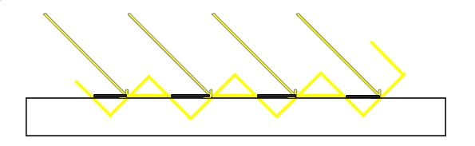
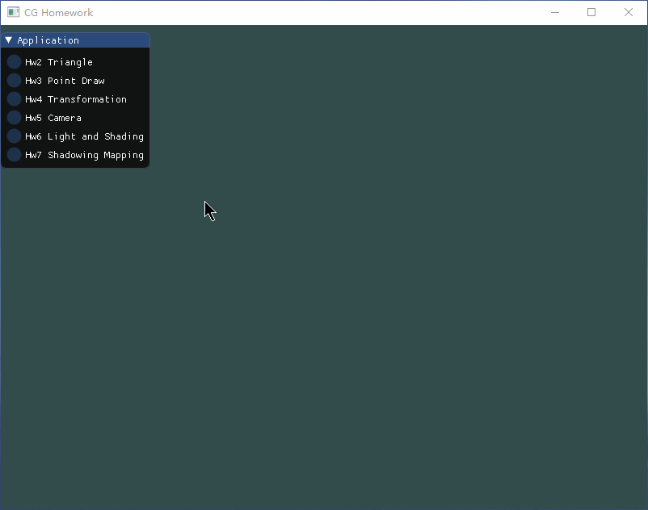

# Homework 7

## Basic

### 1. 实现方向光源的Shadowing Mapping

首先，我们需要实现一个立方体和一个平面。平面可以由立方体变形而成，也可以直接使用两个三角形组成，这里使用后者。因此，我们分别需要两个VAO和VBO存储立方体和平面的节点。

```c++
glGenVertexArrays(2, VAOs);
glGenBuffers(2, VBOs);
// more code about VAO and VBO
```

然后，我们需要创建一个帧缓冲区和一个2D纹理对象，并且将2D纹理对象绑定到帧缓冲区中。

```c++
glGenTextures(1, &depthMap);
glBindTexture(GL_TEXTURE_2D, depthMap);
glTexImage2D(GL_TEXTURE_2D, 0, GL_DEPTH_COMPONENT, SHADOW_WIDTH, SHADOW_HEIGHT, 0, GL_DEPTH_COMPONENT, GL_FLOAT, NULL);
glTexParameteri(GL_TEXTURE_2D, GL_TEXTURE_MIN_FILTER, GL_NEAREST);
glTexParameteri(GL_TEXTURE_2D, GL_TEXTURE_MAG_FILTER, GL_NEAREST);
glTexParameteri(GL_TEXTURE_2D, GL_TEXTURE_WRAP_S, GL_REPEAT);
glTexParameteri(GL_TEXTURE_2D, GL_TEXTURE_WRAP_T, GL_REPEAT);

glGenFramebuffers(1, &FBO);
glBindFramebuffer(GL_FRAMEBUFFER, FBO);
glFramebufferTexture2D(GL_FRAMEBUFFER, GL_DEPTH_ATTACHMENT, GL_TEXTURE_2D, depthMap, 0);
glDrawBuffer(GL_NONE);
glReadBuffer(GL_NONE);
glBindFramebuffer(GL_FRAMEBUFFER, 0);
```

接下来，在每次循环中，我们需要以光源视角进行场景渲染，从而得到深度图。

Shadowing Mapping的算法原理实际上是通过判断处于同一条光线下的不同点的深度，深度大的点将处于阴影中，而深度最小的点将得到光照的效果，从而实现阴影的效果。



我们知道，通过着色器渲染之后的场景，每个点都可以得到其深度值，因此我们可以以光源作为摄像机视角，进行渲染，然后得到每个点的深度值。每次渲染我们都可以将深度图存储在帧缓冲中，在以人为摄像机视角渲染时来判断是否处于阴影下。

```c++
glm::vec3 lightPos3 = glm::vec3(lightPos[0], lightPos[1], lightPos[2]);
glm::vec3 cameraPos3 = glm::vec3(cameraPos[0], cameraPos[1], cameraPos[2]);

glm::mat4 projection = glm::ortho(-10.0f, 10.0f, -10.0f, 10.0f, nearPlane, farPlane);
glm::mat4 model = glm::translate(glm::mat4(1.0f), lightPos3);
glm::mat4 view = glm::lookAt(lightPos3, glm::vec3(0.0f), glm::vec3(1.0f));
glm::mat4 lightSpaceMatrix = projection * view;

// Render depth map
depthShader.use();
depthShader.setGlmMat4("view", view);
depthShader.setGlmMat4("projection", projection);

glViewport(0, 0, SHADOW_WIDTH, SHADOW_HEIGHT);
glBindFramebuffer(GL_FRAMEBUFFER, FBO);
glClear(GL_DEPTH_BUFFER_BIT);
renderScene(depthShader);
glBindFramebuffer(GL_FRAMEBUFFER, 0);
```

因为第一次渲染不需要真实显示在屏幕上，因此我们的片段着色器应该不做任何操作，而顶点着色器只需要按正常的MVP矩阵转换得到最终的对象位置，从而可以正常得到深度缓冲。

```glsl
// VS
#version 450 core
layout (location = 0) in vec3 p;
layout (location = 1) in vec3 c;

out vec3 outColor;

uniform mat4 model;
uniform mat4 view;
uniform mat4 projection;

void main() {
	gl_Position = projection * view * model * vec4(p, 1.0f);
	outColor = c;
}
```

```glsl
// FS
#version 450 core

void main() {}
```

方法`renderScene`只需要简单设置model，然后绘制三角形即可。这里需要传入一个`Shader`的参数，因为两次渲染实现逻辑是一样的，仅仅是使用的着色器不一样。

```c++
void ShadowApplication::renderScene(Shader& shader) {
    // Plane
    glm::mat4 model = glm::mat4(1.0f);
    shader.setGlmMat4("model", model);
    glBindVertexArray(VAOs[0]);
    glDrawArrays(GL_TRIANGLES, 0, 6);
    glBindVertexArray(0);

    // Cube
    model = glm::scale(glm::mat4(1.0f), glm::vec3(0.25f));
    shader.setGlmMat4("model", model);
    glBindVertexArray(VAOs[1]);
    glDrawArrays(GL_TRIANGLES, 0, 36);
    glBindVertexArray(0);
}
```

第二次渲染顶点着色器和片段着色器如下。

```glsl
// VS
#version 450 core
layout (location = 0) in vec3 p;
layout (location = 1) in vec3 n;

out vec3 Normal;
out vec3 FragPos;
out vec4 FragPosLightSpace;

uniform mat4 model;
uniform mat4 view;
uniform mat4 projection;
uniform mat4 lightSpaceMatrix;

void main() {
    gl_Position = projection * view * model * vec4(p, 1.0f);
    FragPos = vec3(model * vec4(p, 1.0f));
    Normal = mat3(transpose(inverse(model))) * n;
    FragPosLightSpace = lightSpaceMatrix * vec4(FragPos, 1.0f);
}
```

```glsl
// FS
#version 450 core
in vec3 Normal;
in vec3 FragPos;
in vec4 FragPosLightSpace;
out vec4 FragColor;

uniform vec3 viewPos;
uniform vec3 lightPos;
uniform sampler2D shadowMap;

float ShadowCalculation(vec4 fragPosLightSpace, vec3 normal, vec3 lightDir) {
    vec3 projCoords = fragPosLightSpace.xyz / fragPosLightSpace.w;
    projCoords = projCoords * 0.5 + 0.5;
    float closestDepth = texture(shadowMap, projCoords.xy).r; 
    float currentDepth = projCoords.z;
    float shadow = currentDepth > closestDepth ? 1.0 : 0.0;
    return shadow;
}

void main() {
    vec3 lightColor = vec3(1.0f);
    vec3 outColor = vec3(1.0f);

    vec3 ambient = 0.1 * lightColor;
    
    vec3 norm = normalize(Normal);
    vec3 lightDir = normalize(lightPos - FragPos);
    float diff = max(dot(norm, lightDir), 0.0f);
    vec3 diffuse = diff * lightColor;

    vec3 viewDir = normalize(viewPos - FragPos);
    vec3 reflectDir = reflect(-lightDir, norm);
    float spec = pow(max(dot(viewDir, reflectDir), 0.0f), 64);
    vec3 specular = spec * lightColor;

    float shadow = ShadowCalculation(FragPosLightSpace, norm, lightDir);
    vec3 lighting = (ambient + (1.0 - shadow) * (diffuse + specular)) * outColor; 

    FragColor = vec4(lighting, 1.0f);
}
```

第二次渲染我们将视图切换回预定好的摄像头位置，然后按上次作业的方式渲染，并计算光照效果。这里需要传入我们第一次渲染得到的帧缓冲的深度图，并在片段着色器里面计算当前点的深度，如果当前深度比深度图中相应位置的深度要大，那就不实现漫反射和镜面反射效果。

```c++
// Render scene
glViewport(0, 0, SCR_WIDTH, SCR_HEIGHT);
glClear(GL_COLOR_BUFFER_BIT | GL_DEPTH_BUFFER_BIT);
sceneShader.use();
projection = glm::perspective((float) glm::radians(45.0f), (float) SCR_WIDTH / SCR_HEIGHT, 0.1f, 100.0f);
view = glm::lookAt(cameraPos3, glm::vec3(0.0f), glm::vec3(0.0f, 1.0f, 0.0f));
sceneShader.setGlmMat4("view", view);
sceneShader.setGlmMat4("projection", projection);
sceneShader.setGlmVec3("lightPos", lightPos3);
sceneShader.setGlmVec3("viewPos", cameraPos3);
sceneShader.setGlmMat4("lightSpaceMatrix", lightSpaceMatrix);
glActiveTexture(GL_TEXTURE0);
glBindTexture(GL_TEXTURE_2D, depthMap);
sceneShader.setInt("shadowMap", 0);
renderScene(sceneShader);
```

最终得到的效果如下：



可以观察到出现奇怪的波纹，经过Bonus中的优化之后，具体得到如下的效果。



### 2. 修改GUI

本次作业需要实现的参数修改并不多，这里我仅实现了对摄像机、光源位置的设置，以及实现深度图的远近范围的设置。

```c++
ImGui::Begin("Settings", NULL, ImGuiWindowFlags_AlwaysAutoResize);
ImGui::RadioButton("Orthographic Projection", &projectionType, 0);
ImGui::RadioButton("Perspective Projection", &projectionType, 1);
ImGui::SliderFloat("Near Plane", &nearPlane, 0.1f, 20.0f);
ImGui::SliderFloat("Far Plane", &farPlane, 0.1f, 20.0f);
ImGui::SliderFloat3("Camera Position", cameraPos, -10.0f, 10.0f);
ImGui::SliderFloat3("Light Position", lightPos, -10.0f, 10.0f);
ImGui::End();
```

## Bonus

### 1. 实现光源在正交/透视两种投影下的Shadowing Mapping

我们上面的光源视角的渲染是在正交投影下实现的，不过实现透视投影也很简单，只需要修改`projection`的值即可。

```c++
glm::mat4 projection;
if (projectionType == 0) {
    projection = glm::ortho(-10.0f, 10.0f, -10.0f, 10.0f, nearPlane, farPlane);
} else if (projectionType == 1) {
    projection = glm::perspective((float) glm::radians(45.0f), 1.0f, nearPlane, farPlane);
}
```

在GUI中，我们也使用ImGui对两种投影的切换实现。(见上节)

### 2. 优化Shadowing Mapping

这里仅根据Learning OpenGL上所提到的方法进行优化。

在上面的代码，我们实现的渲染效果是带有非常多的花纹。这是因为深度图具有解析度，在上面的代码中我们的解析度为`10240*10240`，因此在光源比较远的情况下，可能会出现部分片段被识别为在阴影中。



我们可以引入一个偏移量，在偏移量内的片元都被视为可被光源照射。

```glsl
float bias = max(0.05 * (1.0 - dot(normal, lightDir)), 0.005);
float shadow = currentDepth - bias > closestDepth ? 1.0 : 0.0;
```

甚至，我们可以对纹理阴影进行采样。

```glsl
float shadow = 0.0;
vec2 texelSize = 1.0 / textureSize(shadowMap, 0);
for (int x = -1; x <= 1; x++) {
	for (int y = -1; y <= 1; y++) {
		float pcfDepth = texture(shadowMap, projCoords.xy + vec2(x, y) * texelSize).r; 
		shadow += currentDepth - bias > pcfDepth ? 1.0 : 0.0;        
	}    
}
shadow /= 9.0;
```

其次，为了修复物体对象悬浮效果，我们必须开启正面剔除功能。

```c++
glCullFace(GL_FRONT);
renderScene(depthShader);
glCullFace(GL_BACK);
```

在渲染的时候，可能发现我们实现的平面只有一部分是被光照覆盖，而其余的部分全是阴影。调节Far Plane值会发现可以修改其光照覆盖面积，也可以通过设置纹理环绕来解决。

```c++
glGenTextures(1, &depthMap);
glBindTexture(GL_TEXTURE_2D, depthMap);
glTexImage2D(GL_TEXTURE_2D, 0, GL_DEPTH_COMPONENT, SHADOW_WIDTH, SHADOW_HEIGHT, 0, GL_DEPTH_COMPONENT, GL_FLOAT, NULL);
glTexParameteri(GL_TEXTURE_2D, GL_TEXTURE_MIN_FILTER, GL_NEAREST);
glTexParameteri(GL_TEXTURE_2D, GL_TEXTURE_MAG_FILTER, GL_NEAREST);
glTexParameteri(GL_TEXTURE_2D, GL_TEXTURE_WRAP_S, GL_CLAMP_TO_BORDER);
glTexParameteri(GL_TEXTURE_2D, GL_TEXTURE_WRAP_T, GL_CLAMP_TO_BORDER);
float borderColor[] = { 1.0, 1.0, 1.0, 1.0 };
glTexParameterfv(GL_TEXTURE_2D, GL_TEXTURE_BORDER_COLOR, borderColor);
```

同时需要修改片段着色器的`ShadowCalculation`。

```glsl
if (projCoords.z > 1.0) return 0.0f;
```

## GIF



