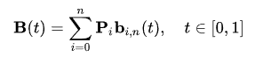
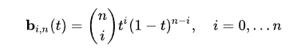
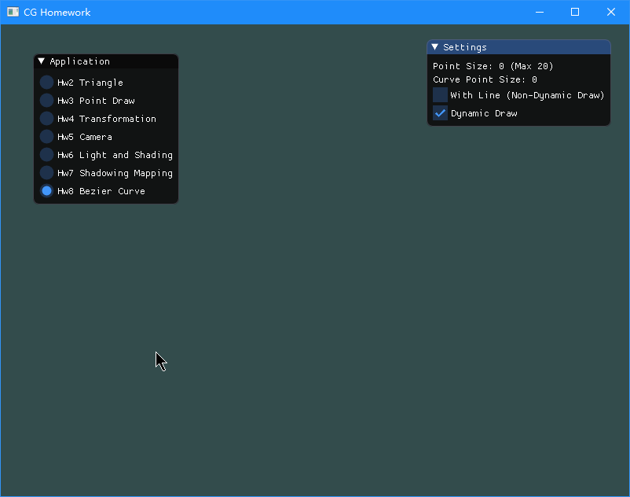

# Homework 8

## Basic

### 1. 左键添加控制点、右键删除控制点

本节将实现用户点击功能，其中左键点击添加Bezier曲线的控制点，右键点击将删除最后一个添加的控制点。

首先，我们需要知道用户的光标位置，以及实现用户鼠标点击事件。下面代码前者可以获取鼠标位置，后者可以获取鼠标点击事件。

```c++
glfwSetCursorPosCallback(window, mouseCallback);
glfwSetMouseButtonCallback(window, mouseButtonCallback);
```

鼠标位置之前我们曾经实现过封装，不过是对鼠标的偏移量来封装，从而实现摄像机移动的效果。因此这里我们需要对`Application`类加入一个新的虚函数，用于处理鼠标位置信息。对于鼠标事件，我们也需要添加一个新的虚函数来处理。

```c++
class Application {
public:
    virtual void inputMouse(GLFWwindow* window, int button, int action, int mods) {}
    virtual void inputMouse(GLFWwindow* window, float x, float y) {}
};
```

然后在`main.cpp`里面添加回调函数。

```c++
void mouseCallback(GLFWwindow* window, double xpos, double ypos) {
    if (app) {
        app->inputMouse(window, (float) xpos, (float) ypos);
    }
}

void mouseButtonCallback(GLFWwindow* window, int button, int action, int mods) {
    if (app) {
        app->inputMouse(window, button, action, mods);
    }
}
```

接下来我们在回调事件中更新我们的鼠标位置，因为鼠标位置信息是Windows坐标系坐标，我们需要将其转换为OpenGL坐标系坐标。由于创建`Application`并没有传递窗口信息，因此我们使用`glfwGetFramebufferSize`来获取窗口信息，从而转换坐标。

```c++
void CurveApplication::inputMouse(GLFWwindow* window, float x, float y) {
    int width, height;
    glfwGetFramebufferSize(window, &width, &height);
    xPos = x / width * 2 - 1.0f;
    yPos = 1.0f - y / height * 2;
}
```

然后对鼠标点击事件进行处理，由于`long long`类型能存储的阶乘最多是$20!$，因此我们限制控制点数量最多为20。这里每添加或删除一个控制点都会调用`bezierCurve`函数，用于更新曲线的点信息。当然，这里该函数目前是空的。

```c++
void CurveApplication::inputMouse(GLFWwindow* window, int button, int action, int mods) {
    if (action == GLFW_PRESS && button == GLFW_MOUSE_BUTTON_LEFT) {
        if (pointSize < 20) {
            points[pointSize * 2] = xPos;
            points[pointSize * 2 + 1] = yPos;
            pointSize++;
            bezierCurve();
        }
    }
    if (action == GLFW_PRESS && button == GLFW_MOUSE_BUTTON_RIGHT) {
        if (pointSize > 0) {
            pointSize--;
            bezierCurve();
        }
    }
}
```

然后我们将点都绘制出来。

```c++
void CurveApplication::render() {
    shader.use();
    // Point
    if (pointSize >= 1) {
        glm::vec3 color(1.0f, 0.0f, 0.0f);
        shader.setGlmVec3("uniColor", color);
        unsigned int VAO, VBO;
        glGenVertexArrays(1, &VAO);
        glGenBuffers(1, &VBO);
        glBindVertexArray(VAO);
        glBindBuffer(GL_ARRAY_BUFFER, VBO);
        glBufferData(GL_ARRAY_BUFFER, sizeof(float) * pointSize * 2, points, GL_STATIC_DRAW);
        glVertexAttribPointer(0, 2, GL_FLOAT, GL_FALSE, 0, ( void*) 0);
        glEnableVertexAttribArray(0);
        glBindBuffer(GL_ARRAY_BUFFER, 0);

        glPointSize(8);
        glDrawArrays(GL_POINTS, 0, pointSize);
        if (pointSize > 2 && (withLine || dynamicDraw)) {
            color = glm::vec3(0.0f, 0.0f, 1.0f);
            shader.setGlmVec3("uniColor", color);
            glDrawArrays(GL_LINE_STRIP, 0, pointSize);
        }
        glBindVertexArray(0);

        glDeleteVertexArrays(1, &VAO);
        glDeleteBuffers(1, &VBO);
    }
}
```

编译运行，效果如下。


### 2. 绘制Bezier曲线

接下来我们要实现`bezierCurve`函数。

贝兹曲线的计算公式如下：



其n阶的伯恩斯坦基底多项式如下：



首先，我们可以在一开始事先计算好0到20的阶乘。

```c++
factorial[0] = 1;
for (int i = 1; i < 21; i++) {
    factorial[i] = factorial[i - 1] * i;
}
```

然后实现伯恩斯坦基底多项式。

```c++
float CurveApplication::bernstein(int i, int n, float t) {
    return factorial[n] / factorial[i] / factorial[n - i] * std::pow(t, i) * std::pow(1 - t, n - i);
}
```

然后即可实现贝兹曲线。

```c++
void CurveApplication::bezierCurve() {
    curvePointSize = 0;
    if (pointSize <= 1) {
        return;
    }
    float step = 0.0f;
    for (int i = 1; i < pointSize; i++) {
        step += std::sqrt(std::pow(points[i * 2] - points[i * 2 - 2], 2) + std::pow(points[i * 2 + 1] - points[i * 2 - 1], 2));
    }
    step = 1.0f / (step * 500);
    if (step < 0.0001f) {
        step = 0.0001f;
    }
    for (float t = 0.0f; t < 1.0f; t += step) {
        float x = 0.0f, y = 0.0f;
        for (int i = 0; i < pointSize; i++) {
            float b = bernstein(i, pointSize - 1, t);
            x += b * points[i * 2];
            y += b * points[i * 2 + 1];
        }
        curvePoints[curvePointSize * 2] = x;
        curvePoints[curvePointSize * 2 + 1] = y;
        curvePointSize++;
    }
}
```

这里的t的步长如果选择一个固定的步长，可能在顶点距离过长的情况下出现曲线绘制变成离散的情况。因此根据各个顶点之间的距离来计算步长，然后乘以一个常量，来得到其步长。

然后绘制曲线的点。

```c++
// Curve
if (curvePointSize >= 1) {
    glm::vec3 color = glm::vec3(0.0f, 0.0f, 0.0f);
    shader.setGlmVec3("uniColor", color);
    unsigned int VAO, VBO;
    glGenVertexArrays(1, &VAO);
    glGenBuffers(1, &VBO);
    glBindVertexArray(VAO);
    glBindBuffer(GL_ARRAY_BUFFER, VBO);
    glBufferData(GL_ARRAY_BUFFER, sizeof(float) * curvePointSize * 2, curvePoints, GL_STATIC_DRAW);
    glVertexAttribPointer(0, 2, GL_FLOAT, GL_FALSE, 0, ( void*) 0);
    glEnableVertexAttribArray(0);
    glBindBuffer(GL_ARRAY_BUFFER, 0);

    glPointSize(5);
    glDrawArrays(GL_POINTS, 0, curvePointSize);
    glBindVertexArray(0);

    glDeleteVertexArrays(1, &VAO);
    glDeleteBuffers(1, &VBO);
}
```

编译运行，效果如下。


## Bonus

### 1. 动态呈现Bezier曲线生成过程

实现Bezier曲线生成的过程，实际上就是按时间得到其t值，然后根据t值来计算在控制点所组成的线段中得到的新的线段，然后迭代下去最终剩下一条线段，而该线段按t值可以找到按1-t和t分割的中间点，该中间点即为曲线上的点。

因此实现曲线生成过程，实际上就是该中间点在曲线上移动的过程。

```c++
// Line
if (pointSize > 2 && dynamicDraw) {
    time += 0.01f;
    if (time >= 1.0f) {
        time = 0.0f;
    }
    dynamicPointSize = pointSize;
    for (int i = 0; i < pointSize * 2; i++) {
        dynamicPoints[i] = points[i];
    }
    for (bool flag = true; flag; ) {
        int prev = dynamicPointSize;
        dynamicPointSize = 0;
        for (int i = 1; i < prev; i++) {
            dynamicPoints[dynamicPointSize * 2] = dynamicPoints[i * 2 - 2] * (1 - time) + dynamicPoints[i * 2] * time;
            dynamicPoints[dynamicPointSize * 2 + 1] = dynamicPoints[i * 2 - 1] * (1 - time) + dynamicPoints[i * 2 + 1] * time;
            dynamicPointSize++;
        }
        if (dynamicPointSize == 2) {
            dynamicPoints[dynamicPointSize * 2] = dynamicPoints[0] * (1 - time) + dynamicPoints[2] * time;
            dynamicPoints[dynamicPointSize * 2 + 1] = dynamicPoints[1] * (1 - time) + dynamicPoints[3] * time;
            dynamicPointSize++;
            flag = false;
        }
        unsigned int VAO, VBO;
        glGenVertexArrays(1, &VAO);
        glGenBuffers(1, &VBO);
        glBindVertexArray(VAO);
        glBindBuffer(GL_ARRAY_BUFFER, VBO);
        glBufferData(GL_ARRAY_BUFFER, sizeof(float) * dynamicPointSize * 2, dynamicPoints, GL_STATIC_DRAW);
        glVertexAttribPointer(0, 2, GL_FLOAT, GL_FALSE, 0, ( void*) 0);
        glEnableVertexAttribArray(0);
        glBindBuffer(GL_ARRAY_BUFFER, 0);

        glPointSize(6);
        glm::vec3 color = glm::vec3(1.0f, 0.0f, 1.0f);
        shader.setGlmVec3("uniColor", color);
        if (flag) {
            glDrawArrays(GL_POINTS, 0, dynamicPointSize);
        } else {
            glDrawArrays(GL_POINTS, 0, dynamicPointSize - 1);
            glm::vec3 color = glm::vec3(1.0f, 1.0f, 0.0f);
            shader.setGlmVec3("uniColor", color);
            glPointSize(8);
            glDrawArrays(GL_POINTS, dynamicPointSize - 1, 1);
        }
        if (pointSize > 2) {
            glm::vec3 color = glm::vec3(1.0f, 1.0f, 1.0f);
            shader.setGlmVec3("uniColor", color);
            glDrawArrays(GL_LINE_STRIP, 0, dynamicPointSize);
        }
        glBindVertexArray(0);

        glDeleteVertexArrays(1, &VAO);
        glDeleteBuffers(1, &VBO);
    }
}
```

编译运行，效果如下。



